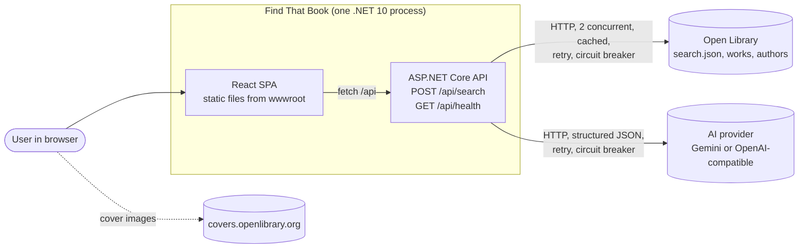

# System context

```mermaid
flowchart LR
    user([User in browser])
    subgraph app["Find That Book (one .NET 10 process)"]
        ui["React SPA<br/>static files from wwwroot"]
        api["ASP.NET Core API<br/>POST /api/search<br/>GET /api/health"]
    end
    ol[("Open Library<br/>search.json, works, authors")]
    covers[("covers.openlibrary.org")]
    ai[("AI provider<br/>Gemini or OpenAI-compatible")]

    user --> ui
    ui -- "fetch /api" --> api
    api -- "HTTP, 2 concurrent, cached,<br/>retry, circuit breaker" --> ol
    api -- "HTTP, structured JSON,<br/>retry, circuit breaker" --> ai
    user -. "cover images" .-> covers
```
