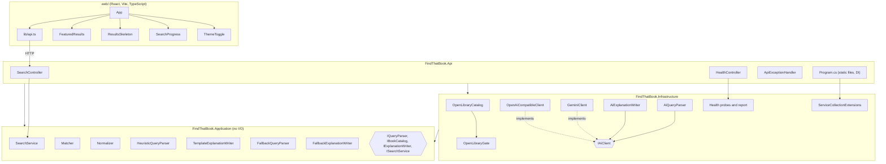

# Layers and dependencies

Arrows point from the dependent project to the project it uses.

```mermaid
flowchart TB
    subgraph web["web/ (React, Vite, TypeScript)"]
        App --> lib_api["lib/api.ts"]
        App --> FeaturedResults
        App --> ResultsSkeleton
        App --> SearchProgress
        App --> ThemeToggle
    end

    subgraph Api["FindThatBook.Api"]
        SearchController
        HealthController
        ApiExceptionHandler
        Program["Program.cs (static files, DI)"]
    end

    subgraph Infra["FindThatBook.Infrastructure"]
        OpenLibraryCatalog
        OpenLibraryGate
        AiQueryParser
        AiExplanationWriter
        IAiClient{{IAiClient}}
        GeminiClient
        OpenAiCompatibleClient
        Health["Health probes and report"]
        DI["ServiceCollectionExtensions"]
    end

    subgraph App_["FindThatBook.Application (no I/O)"]
        SearchService
        Matcher
        Normalizer
        HeuristicQueryParser
        TemplateExplanationWriter
        FallbackQueryParser
        FallbackExplanationWriter
        Abstractions{{IQueryParser, IBookCatalog, IExplanationWriter, ISearchService}}
    end

    lib_api -- "HTTP" --> SearchController
    SearchController --> SearchService
    HealthController --> Health
    Program --> DI
    Infra --> App_
    Api --> Infra
    Api --> App_
    AiQueryParser --> IAiClient
    AiExplanationWriter --> IAiClient
    GeminiClient -.implements.-> IAiClient
    OpenAiCompatibleClient -.implements.-> IAiClient
    OpenLibraryCatalog --> OpenLibraryGate
```
