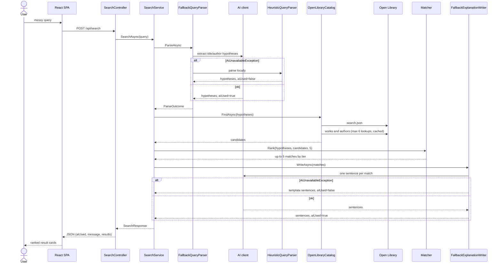

# Search request flow

```mermaid
sequenceDiagram
    actor U as User
    participant W as React SPA
    participant C as SearchController
    participant S as SearchService
    participant P as FallbackQueryParser
    participant A as AI client
    participant H as HeuristicQueryParser
    participant K as OpenLibraryCatalog
    participant O as Open Library
    participant M as Matcher
    participant E as FallbackExplanationWriter

    U->>W: messy query
    W->>C: POST /api/search
    C->>S: SearchAsync(query)
    S->>P: ParseAsync
    P->>A: extract title/author hypotheses
    alt AiUnavailableException
        P->>H: parse locally
        H-->>P: hypotheses, aiUsed=false
    else ok
        A-->>P: hypotheses, aiUsed=true
    end
    P-->>S: ParseOutcome
    S->>K: FindAsync(hypotheses)
    K->>O: search.json
    K->>O: works and authors (max 6 lookups, cached)
    K-->>S: candidates
    S->>M: Rank(hypotheses, candidates, 5)
    M-->>S: up to 5 matches by tier
    S->>E: WriteAsync(matches)
    E->>A: one sentence per match
    alt AiUnavailableException
        E-->>S: template sentences, aiUsed=false
    else ok
        A-->>E: sentences
        E-->>S: sentences, aiUsed=true
    end
    S-->>C: SearchResponse
    C-->>W: JSON (aiUsed, message, results)
    W-->>U: ranked result cards
```
