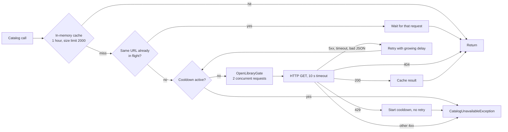

# Open Library protection

```mermaid
flowchart LR
    req[Catalog call] --> cache{"In-memory cache<br/>1 hour, size limit 2000"}
    cache -- hit --> ret[Return]
    cache -- miss --> infl{"Same URL already<br/>in flight?"}
    infl -- yes --> join[Wait for that request] --> ret
    infl -- no --> cd{Cooldown active?}
    cd -- yes --> fail[CatalogUnavailableException]
    cd -- no --> gate["OpenLibraryGate<br/>2 concurrent requests"]
    gate --> http[HTTP GET, 10 s timeout]
    http -- 429 --> start["Start cooldown, no retry"] --> fail
    http -- "5xx, timeout, bad JSON" --> retry["Retry with growing delay"] --> cd
    http -- other 4xx --> fail
    http -- 404 --> ret
    http -- 200 --> store[Cache result] --> ret
```
