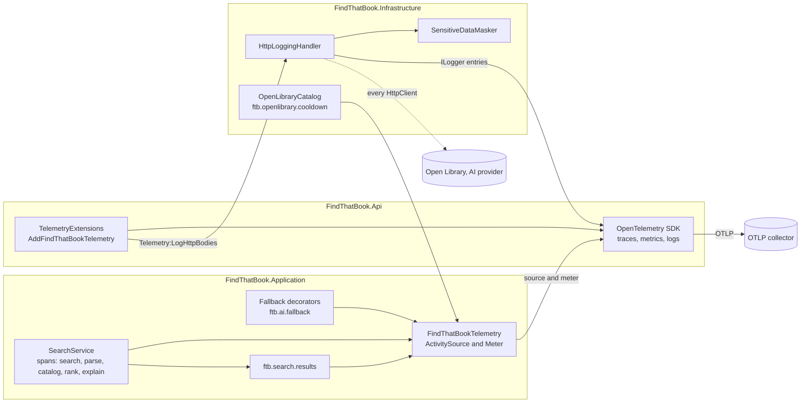

# Telemetry

Off unless `Telemetry:Enabled` is true or `OTEL_EXPORTER_OTLP_ENDPOINT` is set.

```mermaid
flowchart LR
    subgraph Api["FindThatBook.Api"]
        TE["TelemetryExtensions<br/>AddFindThatBookTelemetry"]
        OTel["OpenTelemetry SDK<br/>traces, metrics, logs"]
    end

    subgraph App_["FindThatBook.Application"]
        FT["FindThatBookTelemetry<br/>ActivitySource and Meter"]
        SS["SearchService<br/>spans: search, parse, catalog, rank, explain"]
        FB["Fallback decorators<br/>ftb.ai.fallback"]
        SR["ftb.search.results"]
    end

    subgraph Infra["FindThatBook.Infrastructure"]
        HL["HttpLoggingHandler"]
        M["SensitiveDataMasker"]
        OC["OpenLibraryCatalog<br/>ftb.openlibrary.cooldown"]
    end

    SS --> FT
    FB --> FT
    SS --> SR --> FT
    OC --> FT
    TE --> OTel
    FT -- "source and meter" --> OTel
    HL --> M
    HL -- "ILogger entries" --> OTel
    TE -- "Telemetry:LogHttpBodies" --> HL
    OTel -- "OTLP" --> col[(OTLP collector)]
    HL -. "every HttpClient" .-> ext[(Open Library, AI provider)]
```

`HttpLoggingHandler` masks first and truncates second (8 KB), so a secret cut in half is never logged.
